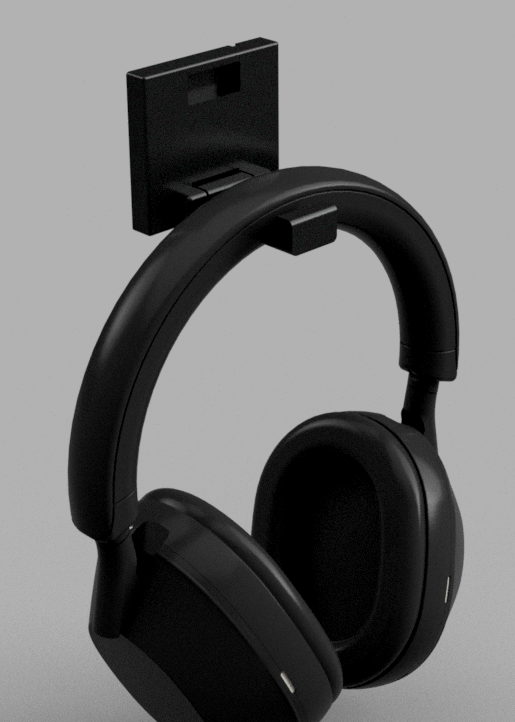
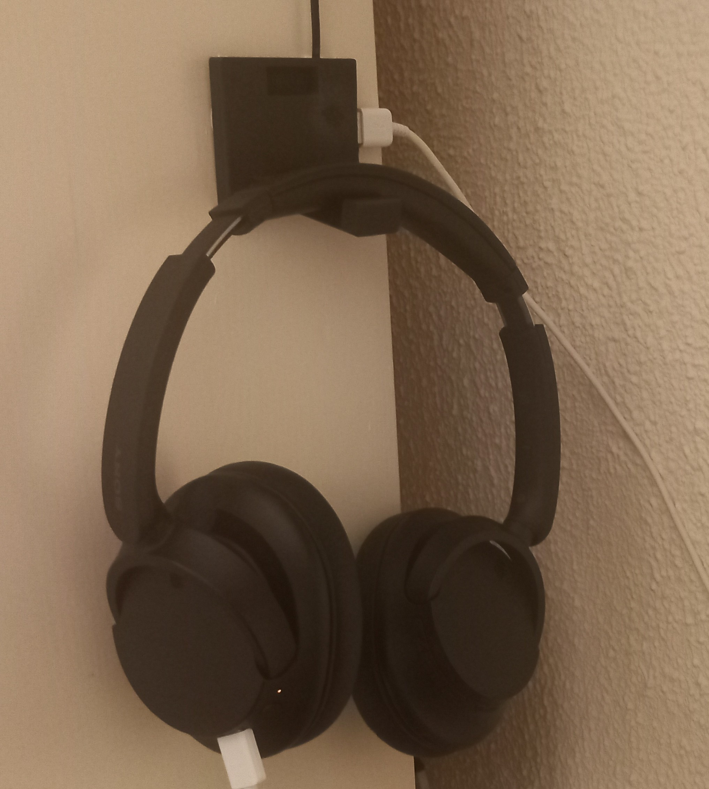
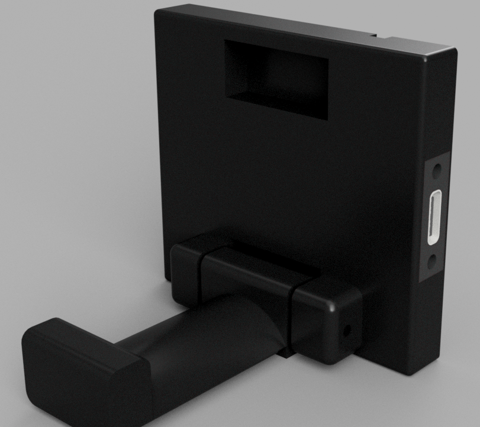
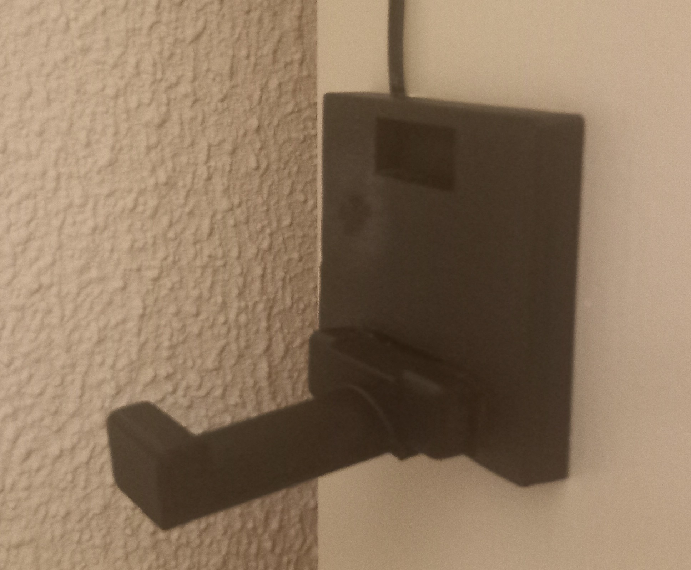
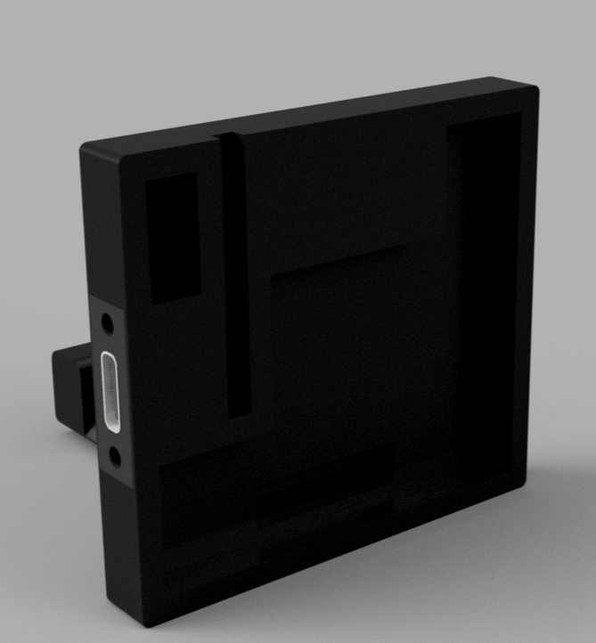
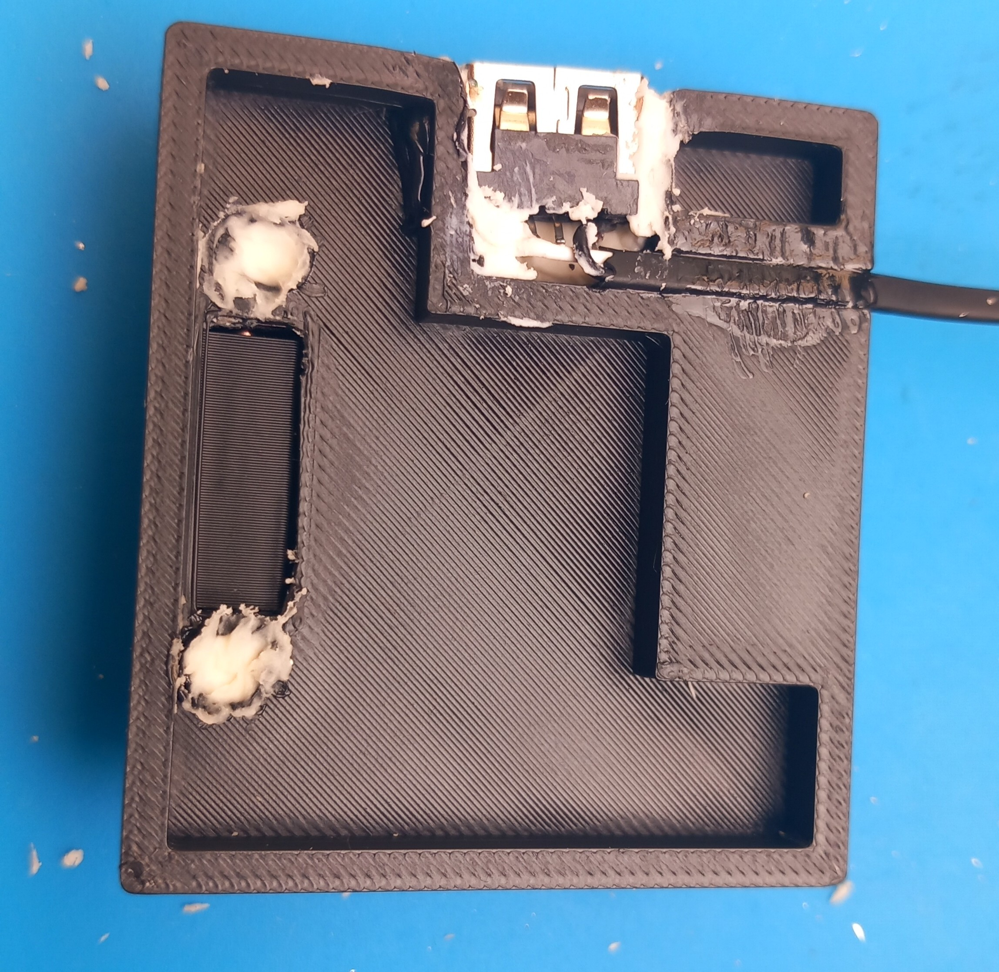
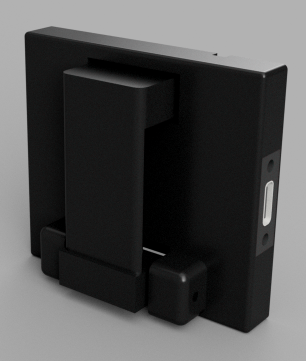
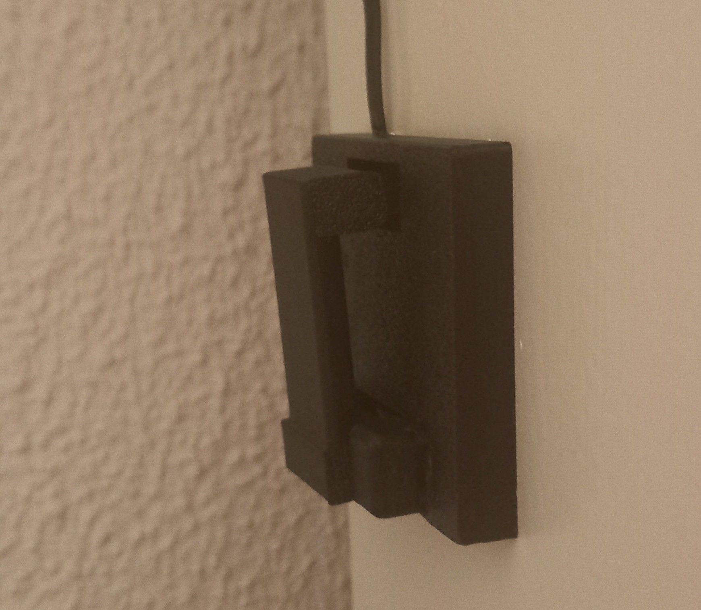

# Controller Holder

<table>
  <tr>
    <th>Design</th>
    <th>Build</th>
  </tr>
  <tr>
    <td></td>
    <td></td>
  </tr>
</table>

## What is it?

A headphone holder with a USB-C port.

<table>
  <tr>
    <th>Design</th>
    <th>Build</th>
  </tr>
  <tr>
    <td></td>
    <td></td>
  </tr>
</table>

## Why did I make it?

I have slowly been cleaning up my desk and making it more organized. And the one thing I hadn't organized yet were my headphones. They were just lying on my desk, so I wanted to make a holder for it. This way my headphones could just hang on my wall, making my desk much cleaner.

## How does it work?

The design is pretty basic. It consists of 5 parts: the hook, the frame, two hinges and the USB-C port. These are all printed seperately and then the hinges are glued on and the hook gets locked in to its position with a 2 mm rod. Finally the USB-C port is soldered to a 5v charger and then gets slotted into the hole on the side and gets screwed down. The cable is routed via the duct on the back.

<table>
  <tr>
    <th>Design</th>
    <th>Build</th>
  </tr>
  <tr>
    <td></td>
    <td></td>
  </tr>
</table>

The hook can than be folded up so the end piece goes into the slot on the top or get folded down. And when you want to charge the headphones you just use the port on the side of the hanger.

<table>
  <tr>
    <th>Design</th>
    <th>Build</th>
  </tr>
  <tr>
    <td></td>
    <td></td>
  </tr>
</table>

## Parts

The only parts needed for this project other than the 3D print is a USB-C port module.

| Image | Name | Purpose | Quantity | Total Cost (USD) | Link | Distributor |
| --- | --- | --- | ---: | ---: | --- | --- |
|  | USB-C port | Charging headphones | 1 | 1.26 | https://nl.aliexpress.com/item/1005009753509210.html | AliExpress |
